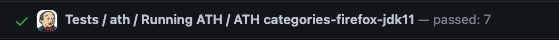
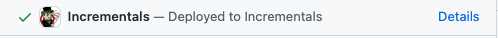

# Jenkins release process

This document describes the technical aspects of the Jenkins release process.
The intended audience is those who want to lead the release process and want more information than the release checklist offers.  
This guide does not aim to be a technical paper, how the release process works in detail. Take a look at the [README.adoc](../README.adoc) for that.

This document covers the whole release process for initial LTS releases. Point releases (.2, .3) do not require the full process and are indicated to be striked through on the checklist.

Bear in mind, as future release lead, you do not need to work through the release checklist all by yourself. Prior release leads and release team member are there to help you out, just ask for assistence in the [#jenkins-release](https://matrix.to/#/#jenkins-release:libera.chat) chat.

## Table of contents
* [Glossary](#glossary)
* [Software Prerequisites](#software-prerequisites)
* [Knowledge Prerequisites](#knowledge-prerequisites)
* [Access Prerequisites](#access-prerequisites)
* [Preparation](#preparation)
  * [Baseline selection](#baseline-selection)
  * [⚠️ Initiate the new LTS baseline](#initiate-the-new-lts-baseline)
  * [⚠️ Prepare release repository](#prepare-the-release-repository)
  * [Update the Bill of Materials](#update-the-bill-of-materials-bom)
  * [Update JCasC integration tests](#update-configurations-as-code-jcasc-integration-tests)
  * [Review Jira issues and GitHub PRs](#review-jira-issues-and-github-prs)
  * [Announce the backporting process](#announce-the-backporting)
  * [Update Jira issues for backporting](#update-jira-issues-for-backporting)
  * [Backporting changes](#backport-changes)
  * [Open a backporting PR](#open-a-backporting-pr)
  * [Review tests](#review-tests)
* [Release Candidate Creation](#release-candidate-creation)
  * [⚠️ Merge the backporting PR](#merge-the-backporting-pr)
  * [⚠️ Publish a pre-release](#publish-a-pre-release)
  * [Announce the release candidate](#send-an-announcement-email)
  * [Check for security updates](#check-for-security-updates)
* [LTS Release](#lts-release)
  * [Announce the start](#announce-the-start-of-the-lts-process)
  * [⚠️ Start the build](#start-the-lts-build)
  * [⚠️ Publish the GitHub release](#publish-the-github-release)
  * [Confirm acceptance tests](#confirm-acceptance-tests)
  * [Update Jira issues](#update-jira-issues)
  * [⚠️ Publish Docker image](#publish-docker-image)
  * [Check docker images](#check-docker-images)
  * [Prepare Jenkins infrastructure for updates](#prepare-infrastructure-for-the-next-release)
  * [Visit changelog](#visit-changelog)

## Glossary
This document uses the following generic terms, which may need a clarification:

- checklist: The [release checklist](https://github.com/jenkins-infra/release/blob/master/.github/ISSUE_TEMPLATE/1-lts-release-checklist.md)
- 2.VVV: The version number of the weekly release the LTS release is based upon, e.g. 2.375.  
  2.VVV.x translates to 2.375.x in this example, .x is no placeholder.
- RC: Release Candidate
- ⚠️: Specific permission required. See [Access Prerequisites](#access-prerequisites).

## Software Prerequisites:
- git 2.38.1 or newer
- bash 5.2 or newer
  - groovy 2.x or newer available in your local packages
  - xdg-utils in your local packages (to be removed in the future, not available on homebrew/macOS)
- maven 3.6.3 or newer
- openjdk 11 or 17

## Knowledge Prerequisites:
- Novice knowledge about GitHub, how to create branches, pull requests and releases.
- Novice knowlege how to use a terminal to run a script and specify an input.
- Competence knowledge how to cherry-pick commits and resolve merge conflicts with a situational merge strategy.
- Beginner knowledge about Jenkins, multibranch pipelines and folders.

## Access Prerequisites:
**The following is only available to release team members.**  
You can safely ignore it, these are not needed for the majority of steps. If they are needed, the steps below will tell you with a warning symbol (⚠️).  
It's recommended to ask someone from the release team to take care of these steps, if you are not a release team member yourself yet.
<details>
<summary>Access to the Jenkins release infrastructure</summary>

- An account on [accounts.jenkins.io](https://accounts.jenkins.io/).
    - The account is part of the `release-core` LDAP group.
- A VPN client to access the Jenkins VPN to access non-public resources.
- Access to [release.ci.jenkins.io](https://release.ci.jenkins.io/) and [trusted.ci.jenkins.io](https://trusted.ci.jenkins.io:1443).
- Be part of the `release` team in the jenkinsci and jenkins-infra organization.

</details>

## Preparation

Timing for the preperation phase is usually 14 days before the RC release date or after the baseline selection an open call for the release lead takes place.  
It's recommended to start the preperation phase as soon as the release lead is selected.

### Baseline selection

Long-Term-Support (LTS) releases are picked every 12 weeks from a weekly baseline. You can find more information about the LTS release line process [LTS Release Line](https://www.jenkins.io/download/lts/).

The [release officer](https://www.jenkins.io/project/board/#release) ends the selection and announces the weekly baseline with an open call for the release lead on the [jenkins-dev mailing list](https://groups.google.com/g/jenkinsci-dev).  
To be the release lead, you need to respond to the call and declare your intest to lead the release.

### Initiate the new LTS baseline
⚠️ **Requires write access to the repository** ⚠️

To initiate a new LTS baseline, run the [init-lts-line](https://github.com/jenkins-infra/release/blob/master/tools/init-lts-line) script in a local clone of the jenkins repository.

**Note**: If you do not have write access on the repository, ask a release team member to run the script for you.

### Prepare the release repository
⚠️ **Requires write access to the repository** ⚠️

To initiate a new LTS baseline, create a new branch based on the default branch, for example `stable-2.VVV`.

You'll need to update several files, see to the LTS checklist.

**Note**: If you do not have write access on the repository, ask a release team member to create the branch for you.

### Update the bill of materials (BOM)

Create a PR updating the [BOM](https://github.com/jenkinsci/bom) to the weekly release, the LTS release is based upon.

1. Modify the newest `bom-2.VVV.x/pom.xml` to declare the LTS line you are initiating.  
This is done by replacing `<artifactId>bom-weekly</artifactId>` in the `<dependencyManagement>` block to `<artifactId>bom-2.VVV.x</artifactId>`.  
2. Create a new file for the LTS release in `bom-2.VVV.x/pom.xml`. This file should contain the following content:
```xml
<?xml version="1.0" encoding="UTF-8"?>
<project xmlns="http://maven.apache.org/POM/4.0.0" xmlns:xsi="http://www.w3.org/2001/XMLSchema-instance" xsi:schemaLocation="http://maven.apache.org/POM/4.0.0 http://maven.apache.org/xsd/maven-4.0.0.xsd">
    <modelVersion>4.0.0</modelVersion>
    <parent>
        <groupId>io.jenkins.tools.bom</groupId>
        <artifactId>parent</artifactId>
        <version>${changelist}</version>
    </parent>
    <artifactId>bom-2.VVV.x</artifactId>
    <packaging>pom</packaging>
    <dependencyManagement>
        <dependencies>
            <dependency>
                <groupId>${project.groupId}</groupId>
                <artifactId>bom-weekly</artifactId>
                <version>${project.version}</version>
                <type>pom</type>
                <scope>import</scope>
            </dependency>
        </dependencies>
    </dependencyManagement>
</project>
```
Keep in mind to replace VVV with the LTS baseline again.

3. Add the created file to the `pom.xml` in the root directory of the repository in the `<modules>` block:
```xml
...
<module>bom-weekly</module>
<module>bom-2.VVV.x</module>
...
```

4. Create a new profile in the sample plugin's pom `<profiles>` located at `sample-plugin/pom.xml`:
```xml
<profiles>
        <profile>
            <id>2.VVV.x</id>
            <properties>
                <bom>2.VVV.x</bom>
                <jenkins.version>2.VVV</jenkins.version>
            </properties>
        </profile>
</profiles>
```

### Update configurations-as-code (JCasC) integration tests

Create a PR to update the [JCasC](https://github.com/jenkinsci/configuration-as-code-plugin/blob/master/integrations/pom.xml) integration tests to the weekly release, the LTS release is based upon.  
This is done by replacing the `jenkins.version` property in the `<properties>` block to the version of the weekly release you are basing the LTS line on.

### Review Jira issues and GitHub PRs

Make sure that all the Jira issues and GitHub PRs are in the correct state and that Jira issues are labeled with `lts-candidate`. Visit the checklist for more information.

### Announce the backporting

Send a backporting announcement email to the [jenkinsci-dev](https://groups.google.com/g/jenkinsci-dev) mailing list, using the [default](https://groups.google.com/g/jenkinsci-dev/c/sZY2WXoWLWM) template.
Remember to exchange the LTS version, release date and Jira URLs.

### Update Jira issues for backporting

Use the [LTS candidates](https://issues.jenkins.io/issues/?filter=12146) query to list issues eligible for a backport.  
Add `2.VVV.p-fixed` and remove `lts-candidate` or add `2.VVV.p-rejected` and retain the `lts-candidate` label.  
.p stands for patch release, like .1, .2, or .3.

### Backport changes

Run the [list-issue-commits script](https://github.com/jenkins-infra/release/blob/master/tools/list-issue-commits) to locate commits via jira ID and backport them via `cherry-pick -x $commit` into a separate branch based on `stable-2.VVV`.  
Incase there are conflicting commits, pick an [appropriate merge strategy](https://git-scm.com/docs/merge-strategies) to address the conflicts without undoing the change or merging in newer content.

### Open a backporting PR

Open a PR against the `stable-2.VVV` branch from your separate backporting branch from the prior step.  
Use the [list-issue-commits script](https://github.com/jenkins-infra/release/blob/master/tools/list-issue-commits) to generate a list of issues to include in the PR description.  
Visit the checklist for more information.  
Additionally, take a look at the [release](https://github.com/jenkins-infra/release/issues?q=is%3Aclosed+label%3Alts-candidate+) and [packaging](https://github.com/jenkinsci/packaging/issues?q=is%3Aclosed+label%3Alts-candidate) repository, for additional LTS candidates.

### Review tests
1. Review acceptance tests. Take a look at the checks of your backporting PR from step 10, and make sure, that `Tests / ath / Running ATH / ATH` are green:  
  
The amount of tests may vary.
2. Review BOM tests. Make sure, that all tests from your BOM PR are green.
3. Review JCasC tests. Make sure, that all tests from your JCasC PR are green.

### Update dependabot stable branch in core

Replace `stable-2.xxx` with the new LTS stable branch version.  
Take a look at the [example PR](https://github.com/jenkinsci/jenkins/pull/8004) how to do that.

## Release Candidate Creation

Timing for the RC creation is usually the same day the RC is published.

### Merge the backporting PR
⚠️ **Requires write access to the repository** ⚠️

Merge the backporting PR from the prior step into the `stable-2.VVV` branch. Do not squash the commits, create a merge commit.

**Note**: If you do not have write access on the repository, ask a release team member to merge the PR for you.

### Obtain the RC URL

If the build passes, obtain the "Incrementals" URL from the "Checks" tab of the stable branch:  
  
Select `Details` -> `jenkins-war` and obtain the `jenkins-war-2.VVV-rcXXXXX.CCCCCCCCCCCCC.war`
URL. `C` is the commit hash of the merge commit and acts as placeholder.

### Publish a pre-release
⚠️ **Requires write access to the repository** ⚠️

Create a pre-release on GitHub for the `stable-2.VVV` branch based on [this](https://github.com/jenkinsci/jenkins/releases/tag/jenkins-2.361.1-rc) sample.

**Note**: If you do not have write access on the repository, ask a release team member to create the pre-release for you.

### Send an announcement email

Send an announcement email to the jenkinsci-devforum mailing list. Use [this](https://groups.google.com/g/jenkinsci-dev/c/ox6SCyOQLuE/m/C-dsLZ4vBwAJ) example.

### Check for security updates

Check with the security team, whether a security update is planned for this release, which impacts the LTS release and core itself. Security pre-announcements are sent to the [jenkinsci-advisories](https://groups.google.com/g/jenkinsci-advisories) mailing list.  
Even if no security update is planned, it is a good idea to verify with the security team that no security update is is progress.  
In case a security update impacting the LTS release is planned, the release process is paused and the security team takes over the release.

## LTS release

Timing for the LTS release is usually the same day the LTS release is published.

### Announce the start of the LTS process

Take a look at the checklist, and make sure, that both channels are notified in advance.

### Start the LTS build
⚠️ **Requires access to the Jenkins VPN** ⚠️

Run the release job on [release.ci.jenkins.io](https://release.ci.jenkins.io/job/core/job/stable/job/release/) if no security release for Jenkins is planned.

**Note**: If you do not have access to the Jenkins VPN, ask a release team member to start the job for you.

### Publish the GitHub release
⚠️ **Requires write access to the repository** ⚠️

Once the build is complete, publish the GitHub release for the `stable-2.VVV` branch, selecting the `jenkins-2.VVV.V` tag. Use [this](https://github.com/jenkinsci/jenkins/releases/tag/jenkins-2.361.1) sample.

**Note**: If you do not have write access on the repository, ask a release team member to publish the release for you.

### Confirm acceptance tests
If the release build passes, confirm if all acceptance tests are green:
1. Confirm [Datadog checks](https://p.datadoghq.com/sb/0Igb9a-e6849e5e019250ef5aaea3589297fe8b).
2. Confirm [Debian installer acceptance tests](https://ci.jenkins.io/job/Infra/job/acceptance-tests/job/install-lts-debian-package/) are passing.
3. Confirm [Red Hat installer acceptance tests](https://ci.jenkins.io/job/Infra/job/acceptance-tests/job/install-lts-redhat-rpm/) are passing.

For good measures, check the console log to confirm that the correct release package was used (e.g. search for `2.VVV`).

### Update Jira issues

Adjust state and `Released As` of [Jira issues](https://issues.jenkins.io/) fixed in the release (see the [changelog](https://www.jenkins.io/changelog-stable) for issue links)

### Publish Docker image
⚠️ **Requires write access to the [jenkinsci/docker repository](https://github.com/jenkinsci/docker) ** ⚠️
💡 **Access to the network containing trusted.ci.jenkins.io could help in case of error but is not mandatory** 💡 

Create a new tag in the [jenkinsci/docker repository](https://github.com/jenkinsci/docker) with the value of the released core version:
- `git tag --annotate --message="2.VVV.V" 2.VVV.V`
- `git push upstream 2.VVV.V`

Publish a release on GitHub associated with the tag pushed.

The [Container image job in trusted.ci.jenkins.io](https://trusted.ci.jenkins.io:1443/job/Containers/job/Core%20Release%20Containers) should detect the tag in the next 15 minutes and automatically publish it to the DockerHub.

**Note**: If you do not have access to the network trusted.ci.jenkins.io is in, ask a release team or infrastructure team member to start the job for you. Access to the VPN is not sufficient.

### Check docker images

Confirm that the images are available at [Docker hub](https://hub.docker.com/r/jenkins/jenkins/tags).

### Update the helm charts
⚠️ **Requires write access to the repository** ⚠️

Update the helm charts to the new LTS release. The `jenkins-dependency-updater` bot generates the PR automatically in the [jenkinsci/helm-charts](https://github.com/jenkinsci/helm-charts) repository. Once approved and merged, it's released automatically.  
If the bot didn't create a PR yet, either wait for the next cron schedule or run the [`sync-lts`](https://github.com/jenkinsci/helm-charts/actions/workflows/sync-lts.yaml) workflow manually.

### Prepare infrastructure for the next release

- Create a [helpdesk](https://github.com/jenkins-infra/helpdesk/issues) ticket to update `ci.jenkins.io`, `trusted.ci`, `cert.ci` and `release.ci` to the new LTS release, [example](https://github.com/jenkins-infra/helpdesk/issues/2816)

### Visit changelog

Check [LTS changelog](https://www.jenkins.io/changelog-stable/) is visible on the downloads site.
